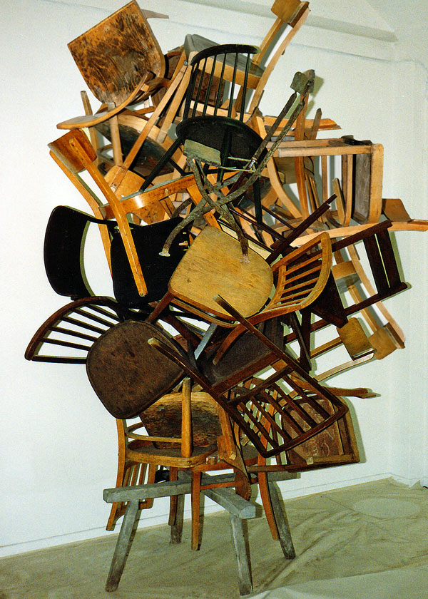

<h1 align="center">
   
  
   
  Autonomer Turmbau-Roboter; Team Pisa (5)
   
</h1>

<h4 align="center">Ein Schulprojekt des <a href="https://www.zbw.ch/" target="_blank">ZBW</a>.</h4>

## Aufgabenstellung
Ein horizontales wie auch quadratisches Spielfeld bieten den Rahmen, in dem sich der Roboter bewegt. Darauf befinden sich an beliebiger Stelle rote und grüne Holzwürfel. Der Roboter muss einen Turm aus den fünf Würfeln in richtiger farblicher Reihenfolge und in einem vorgegebenen Kreis von 200mm aufbauen. In möglichst kurzer Zeit soll dieser Vorgang autonom vonstattengehen. Der Kreis, wie auch die Würfel können an beliebiger Stelle im Spielfeld platziert sein. Mit manueller Auslösung wird dieser Vorgang gestartet, wobei der Roboter manuell ins Spielfeld gesetzt und ausgerichtet wird. Sobald der Turm selbstständig im Zielkreis steht, verlässt der Roboter den Zielkreis. Somit endet der autonome Prozess.

## Projektstatus

|Meilenstein||
|-|-|
|**Start**|✅|
|Projektauftrag|✅|
|Pflichtenheft|✅|
|Zusammenfassung|✅|
|**MS1 Initialisierung**|⬜|
|Konzeptentscheid|⬜|
|Modell / Prototyp Muster|⬜|
|**MS2 Konzept**|⬜|
|Mechanik Zeichnungen|⬜|
|Elektronik Schema|⬜|
|Software Design|⬜|
|**MS3 Konstruktion / Design**|⬜|
|Mechanische Herstellung|⬜|
|Montage|⬜|
|Elektrische Verdrahtung |⬜|
|Software Programm|⬜|
|Inbetriebnahme|⬜|
|**MS4 Realisierung**|⬜|
|Fehlerbehebung / Optimierung|⬜|
|Dokumentation fertigstellen|⬜|
|**MS5 Abgabe Dokumentation**|⬜|
|**MS6 Projekt Präsentation**|⬜|

## License

[MIT](https://choosealicense.com/licenses/mit/)
